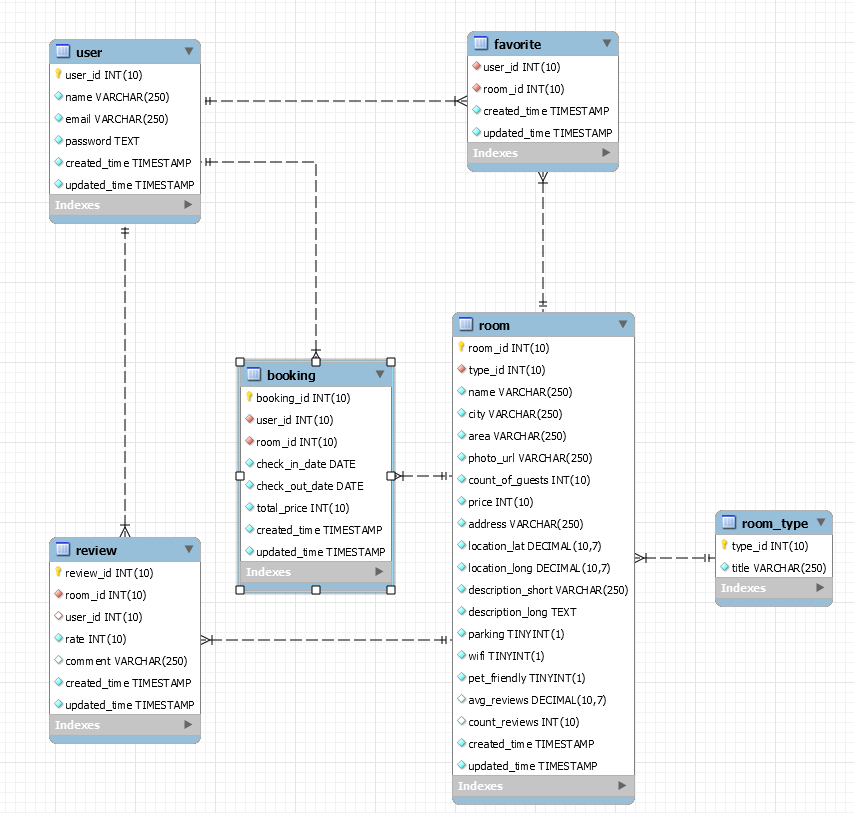

# WDA Project - Hotel - v3.0

## Τίτλος

Web εφαρμογή αναζήτησης καταλυμάτων

## Domain

[[http://hotel.collegelink.localhost]{.underline}](http://hotel.collegelink.localhost)

## Περιγραφή

Το παρόν έγγραφο περιγράφει τις λειτουργικές απαιτήσεις για την
δημιουργία ενός website το οποίο θα έχει σαν στόχο να εξυπηρετήσει ένα
ξενοδοχείο ως προς τα δωμάτια και τις κρατήσεις του, δίνοντας την
δυνατότητα σε χρήστες να δουν τα δωμάτια και να καταχωρήσουν κάποια
κράτηση.

Το έγγραφο χωρίζεται στις εξής ενότητες:

- Οθόνες / Σελίδες

- Λειτουργικές απαιτήσεις

- Βάση Δεδομένων

- Προαπαιτούμενα

- Έτοιμα δεδομένα

## Οθόνες / Σελίδες

| Σελίδα / Url | Τίτλος                  | Λειτουργικότητα                                                                           |
| ------------ | ----------------------- | ----------------------------------------------------------------------------------------- |
| register.php | Εγγραφή Χρήστη          | Εγγραφή του χρήστη                                                                        |
| login.php    | Σύνδεση Χρήστη          | Σύνδεση του χρήστη                                                                        |
| index.php    | Αναζήτηση δωματίου      | Αναζήτηση δωματίων με βάση τα διαθέσιμα φίλτρα                                            |
| list.php     | Αποτελέσματα Αναζήτησης | 1. Παρουσίαση των αποτελεσμάτων αναζήτησης. 2. Εφαρμογή επιπλέον φίλτρων στα αποτελέσματα |
| room.php     | Πληροφορίες Δωματίου    | Προβολή όλων των πληροφοριών ενός δωματίου                                                |
| profile.php  | Προφίλ Χρήστη           | Προβολή όλων των πληροφοριών του χρήστη                                                   |

## Λειτουργικές Απαιτήσεις

Το συγκεκριμένο κεφάλαιο περιλαμβάνει το σύνολο των λειτουργικών
απαιτήσεων του Project. Χωρίζεται σε γενικές απαιτήσεις και ανά σελίδα.

### Γενικές Απαιτήσεις

#### Form Validation

Κάθε φόρμα που θα παρουσιάζεται στις απαιτήσεις θα περιλαμβάνει
validator ο οποίος θα αποτρέπει τον χρήστη από το submit της φόρμας σε
περίπτωση που δεν είναι έγκυρα όλα τα πεδία. Για κάθε τέτοιο πεδίο θα
υπάρχει ειδική σήμανση.

Το validation θα πρέπει να υλοποιηθεί τόσο σε frontend αλλά και σε
backend.

### Ανά Σελίδα

Οι παρακάτω λειτουργικές απαιτήσεις χωρίζονται ανά σελίδα.

Οι λειτουργικότητες με την ένδειξη "**\[συνδεδεμένος χρήστης\]**"
χρειάζεται να είναι συνδεδεμένος ο χρήστης για να τις εκτελέσει.

#### Εγγραφή χρήστη

- Ο χρήστης θα μπορεί να κάνει εγγραφή χρησιμοποιώντας τα παρακάτω στοιχεία:

  - Όνομα (required)

  - Email (θα χρησιμοποιείται για το login) (required)

  - Επανάληψη του email (required)

  - Κωδικός Πρόσβασης (required)

- **\[συνδεδεμένος χρήστης\]** Εάν υπάρχει ήδη συνδεδεμένος χρήστης θα
  > γίνεται ανακατεύθυνση στην αρχική σελίδα

#### Σύνδεση χρήστη

- Ο χρήστης θα μπορεί να κάνει σύνδεση χρησιμοποιώντας τα παρακάτω στοιχεία:

  - Email (required)

  - Κωδικός Πρόσβασης (required)

- **\[συνδεδεμένος χρήστης\]** Εάν υπάρχει ήδη συνδεδεμένος χρήστης θα γίνεται ανακατεύθυνση στην αρχική σελίδα

#### Αναζήτηση δωματίου

- Ο χρήστης θα μπορεί να κάνει αναζήτηση σε διαθέσιμα δωμάτια σύμφωνα με τις παρακάτω παραμέτρους:

  - Ημ. check-in (required)

  - Ημ. check-out (required)

  - Πόλη (required)

  - Είδος δωματίου

- Κατά την αναζήτηση ο χρήστης θα μεταβαίνει στην σελίδα "Αποτελέσματα
  > Αναζήτησης"

#### Αποτελέσματα Αναζήτησης

Μετά από κάθε αναζήτηση η εφαρμογή θα κάνει ανακατεύθυνση τον χρήστη
στην σελίδα "Αποτελέσματα Αναζήτησης".

- Παρουσίαση των αποτελεσμάτων και περιέχει όλες τις πληροφορίες για τα διαθέσιμα δωμάτια:

  - φωτογραφία

  - όνομα

  - πόλη & τοποθεσία

  - τύπος δωματίου

  - αριθμό φιλοξενουμένων

  - τιμή ανά βραδιά

  - και μικρή περιγραφή.

- Ο χρήστης θα μπορεί να μεταβεί στην σελίδα του δωματίου κάνοντας κλικ πάνω στο δωμάτιο

- Ο χρήστης θα μπορεί να ορίσει επιπλέον φίλτρα με βάση τις εξής παραμέτρους:

  - Είδος δωματίου (πολλαπλές επιλογές)

  - Πόλη (πολλαπλές επιλογές)

  - Εύρος τιμής (range)

  - Αριθμό φιλοξενουμένων

  - Check-in και Check-out (ημερολόγιο)

- Τα αποτελέσματα αναζήτησης θα πρέπει να μένουν τα ίδια σε κάθε επαναφόρτωση της σελίδας (χρήση παραμέτρων url)

#### Πληροφορίες Δωματίου

- Ο χρήστης θα μπορεί να δει όλες τις πληροφορίες ενός δωματίου:

  - φωτογραφία

  - όνομα

  - πόλη & τοποθεσία

  - τύπος δωματίου

  - αριθμό φιλοξενουμένων

  - τιμή ανά βραδιά

  - μικρή και μεγάλη περιγραφή

  - μέσο όρο αξιολογήσεων

  - τοποθεσία του δωματιου σε χάρτη (Google Maps)

  - εάν το δωμάτιο είναι κρατημένο ή όχι για μια συγκεκριμένη περίοδο

  - Εάν έχει τα επιπλέον χαρακτηριστικά όπως WiFi, Parking, Pet Friendly

- Ο χρήστης θα μπορεί να αλλάξει τις ημερομηνίες Check-in και

  > Check-out (ημερολόγιο) και θα ανανεώνεται η σελίδα του δωματίου
  > καθώς και η ένδειξη εάν είναι κρατημένο ή όχι

- **\[συνδεδεμένος χρήστης\]** Ο χρήστης θα μπορεί να κάνει επιτόπου κράτηση του δωματίου από αυτή την σελίδα (θα πρέπει να υπάρχει επιπλέον έλεγχος από πίσω ότι κατά την κράτηση το δωμάτιο είναι όντως ελεύθερο)

- Θα εμφανίζονται όλες οι κριτικές του δωματίου με την πιο πρόσφατηπάνω. Για κάθε κριτική θα φαίνεται:

  - Το όνομα του χρήστη που την έκανε την κριτική

  - Η αξιολόγηση με την μορφή αστεριών (βλ. mockup)

  - Το σχόλιο, εάν υπάρχει

  - Ημερομηνία δημιουργίας της κριτικής

- **\[συνδεδεμένος χρήστης\]** Ο χρήστης θα μπορεί να προσθέσει μια κριτική για το συγκεκριμένο δωμάτιο. Μετά την προσθήκη της κριτικής θα πρέπει να ανανεώνεται η σελίδα με σκοπό να εμφανίζεται η νέα κριτική.

- **\[συνδεδεμένος χρήστης\]** Ο χρήστης θα μπορεί να προσθέσει/αφαιρέσει το συγκεκριμένο δωμάτιο στα αγαπημένα. Μετά την συγκεκριμένη ενέργεια θα πρέπει να γίνεται επαναφόρτωση της σελίδας για να εμφανίζεται η νέα πληροφορία

#### Προφίλ Χρήστη

Η συγκεκριμένη σελίδα θα είναι διαθέσιμη μόνο εάν υπάρχει συνδεδεμένος
χρήστης. Διαφορετικά θα γίνεται ανακατεύθυνση στην αρχική σελίδα.

- Ο χρήστης θα μπορεί να δει όλο το ιστορικό κρατήσεων. Για κάθε κράτηση θα φαίνεται:

  - Το όνομα του δωματίου

  - Φωτογραφία

  - Μικρή περιγραφή

  - Check-in date

  - Check-out date

  - Τύπος δωματίου

  - Συνολικό ποσό κράτησης (τιμή δωματίου x κόστος δωματίου)

- Ο χρήστης θα μπορεί να μεταβεί στην σελίδα του δωματίου κάθε κράτησης από το ιστορικό

- Ο χρήστης θα μπορεί να δει τα αγαπημένα δωμάτια με το πιο πρόσφατο πάνω

- Ο χρήστης θα μπορεί να δει όλες τις κριτικές που έχει αφήσει για κάθε δωμάτιο. Για κάθε κριτική θα εμφανίζεται:

  - Το όνομα του δωματίου

  - Η αξιολόγηση

- Ο χρήστης θα έχει τη δυνατότητα να κάνει logout από την εφαρμογή

#### Επιπλέον ενότητες

##### Επικεφαλίδα

- Η επικεφαλίδα της εφαρμογής θα περιλαμβάνει τα εξής στοιχεία:

  - Link στην αρχική σελίδα της εφαρμογής

  - **\[συνδεδεμένος χρήστης\]** Link στο προφίλ του χρήστη

##### Υποσέλιδο

- Copyright εφαρμογής

## Βάση Δεδομένων

Παρακάτω φαίνεται το σχήμα της βάσης δεδομένων με ένα ER διάγραμμα:

{width="6.5in"height="6.194444444444445in"}

**Σημείωση**: Η δομή της βάσης δεδομένων θα δοθεί έτοιμη και δεν
χρειάζεται κάποια σχεδίαση για το συγκεκριμένο project.

Μπορείτε να δείτε την ανάλυση των πινάκων στο [[APPENDIX
I]{.underline}](#appendix-i---ανάλυση-πινάκων).

## Προαπαιτούμενα

- Εγκατάσταση [[xampp]{.underline}](https://www.apachefriends.org/index.html) (Μπορείτε να βρείτε οδηγίες [[εδώ]{.underline}](https://www.youtube.com/watch?v=N6ENnaRotmo))

- Εγκατάσταση [[git]{.underline}](https://git-scm.com/downloads) for windows (or mac)

- Εγκατάσταση κάποιου programming text editor [[Notepad++]{.underline}](https://notepad-plus-plus.org/download/v7.5.6.html) ή [[Sublime Text]{.underline}](https://www.sublimetext.com/3)

## Έτοιμα Δεδομένα

1. Έτοιμο σχήμα στη βάση με sample data (ο πίνακας με τα στοιχεία του ξενοδοχείου)

2. Φάκελος με φωτογραφίες που θα χρειαστούν για την βάση δεδομένων στον πίνακα room, όπου κάθε φωτογραφία αντιστοιχεί σε ένα δωμάτιο.

## APPENDIX I - Ανάλυση Πινάκων

### Χρήστης

| Πεδίο        | Τύπος     | Περιγραφή                                         |
| ------------ | --------- | ------------------------------------------------- |
| user_id      | Integer   | Μοναδικός αριθμός χρήστη (Αύξων αριθμός)          |
| name         | Varchar   | Όνομα χρήστη. π.χ. “John Doe”                     |
| email        | Varchar   | Email του χρήστη. Χρησιμοποιείται για την σύνδεση |
| password     | Text      | Κωδικός πρόσβασης του χρήστη σε hash μορφή        |
| created_time | Timestamp | Ημ. και ώρα δημιουργίας                           |
| updated_time | Timestamp | Ημ. και ώρα τελευταίας ενημέρωσης                 |

### Δωμάτιο

| Πεδίο             | Τύπος     | Περιγραφή                                                                 |
| ----------------- | --------- | ------------------------------------------------------------------------- |
| room_id           | Integer   | Μοναδικός αριθμός δωματίου (Αύξων αριθμός)                                |
| type_id           | Integer   | Είδος δωματίου (βλ. πίνακα Είδος Δωματίου)                                |
| name              | Varchar   | Όνομα δωματίου. π.χ. “3κλινο με θέα”                                      |
| city              | Varchar   | Πόλη στην οποία βρίσκεται το δωμάτιο                                      |
| area              | Varchar   | Περιοχή στην οποία βρίσκεται το δωμάτιο                                   |
| photo_url         | Varchar   | Relative url της φωτογραφίας του δωματίου, στον φάκελο με τις φωτογραφίες |
| count_of_guests   | Integer   | Αριθμός φιλοξενουμένων που μπορεί να δεχτεί το δωμάτιο                    |
| price             | Decimal   | Τιμή για κάθε βράδυ                                                       |
| address           | Varchar   | Διεύθυνση δωματίου                                                        |
| location_lat      | Decimal   | Γεωγραφικό πλάτος του δωματίου                                            |
| location_long     | Decimal   | Γεωγραφικό μήκος του δωματίου                                             |
| description_short | Varchar   | Μικρή περιγραφή του δωματίου με περιορισμένους χαρακτήρες                 |
| description_long  | Text      | Εκτενής περιγραφή του δωματίου                                            |
| parking           | Boolean   | Εάν περιλαμβάνει ιδιωτικό parking το δωμάτιο                              |
| wifi              | Boolean   | Εάν περιλαμβάνει WiFi το δωμάτιο                                          |
| pet_friendly      | Boolean   | Εάν δέχεται κατοικίδια                                                    |
| avg_reviews       | Float     | Μέσος όρος αξιολογήσεων                                                   |
| count_reviews     | Integer   | Αριθμός αξιολογήσεων                                                      |
| created_time      | Timestamp | Ημ. και ώρα δημιουργίας                                                   |
| updated_time      | Timestamp | Ημ. και ώρα τελευταίας ενημέρωσης                                         |

### Είδος Δωματίου

Ο παρακάτω πίνακας περιλαμβάνει τα κατάλληλα δεδομένα και δεν χρειάζεται κάποια διαχείριση στο συγκεκριμένο project.

| Πεδίο   | Τύπος   | Περιγραφή                                                 |
| ------- | ------- | --------------------------------------------------------- |
| type_id | Integer | Μοναδικός αριθμός του είδους του δωματίου (Αύξων αριθμός) |
| name    | Varchar | Είδος δωματίου. π.χ. “Μονόκλινο”                          |

### Κράτηση

| Πεδίο          | Τύπος     | Περιγραφή                                  |
| -------------- | --------- | ------------------------------------------ |
| booking_id     | Integer   | Μοναδικός αριθμός κράτησης (Αύξων αριθμός) |
| user_id        | Integer   | Κωδικός χρήστη που έκανε την κράτηση       |
| room_id        | Integer   | Το δωμάτιο που περιλαμβάνει η κράτηση      |
| total_price    | Integer   | Συνολική τιμή της κράτησης                 |
| check_in_date  | Date      | Ημερομηνία του check-in                    |
| check_out_date | Date      | Ημερομηνία του check-out                   |
| created_time   | Timestamp | Ημ. και ώρα δημιουργίας                    |
| updated_time   | Timestamp | Ημ. και ώρα τελευταίας ενημέρωσης          |

### Αγαπημένο

| Πεδίο        | Τύπος     | Περιγραφή                                |
| ------------ | --------- | ---------------------------------------- |
| user_id      | Integer   | Ο χρήστης στον οποίο ανήκει το αγαπημένο |
| room_id      | Integer   | Το δωμάτιο                               |
| created_time | Timestamp | Ημ. και ώρα δημιουργίας                  |
| updated_time | Timestamp | Ημ. και ώρα τελευταίας ενημέρωσης        |

### Κριτική

| Πεδίο        | Τύπος     | Περιγραφή                                           |
| ------------ | --------- | --------------------------------------------------- |
| review_id    | Integer   | Μοναδικός αριθμός κριτικής (Αύξων αριθμός)          |
| room_id      | Integer   | Το δωμάτιο στο οποίο ανήκει η κριτική               |
| user_id      | Integer   | Ο χρήστης που άφησε την κριτική                     |
| rate         | Integer   | Αξιολόγηση 1-5                                      |
| comment      | Text      | Το σχόλιο που έχει αφήσει ο χρήστης για την κριτική |
| created_time | Timestamp | Ημ. και ώρα δημιουργίας                             |
| updated_time | Timestamp | Ημ. και ώρα τελευταίας ενημέρωσης                   |
